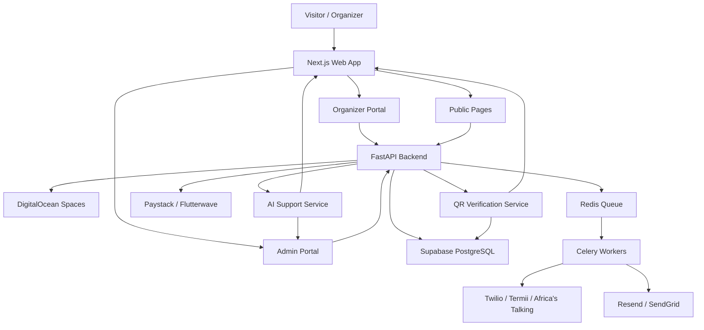

# Accredit.vip

Accredit.vip is a premium event infrastructure platform for invitation distribution, guest management, QR accreditation, public event discovery, and event operations.

It is designed for:
- Weddings
- Concerts
- Conferences
- Corporate events
- Private celebrations
- Large-scale public events

Its goal is to help organizers create events, manage guests, send invitations, handle accreditation, and monitor attendance from a single platform.

## 1. Product Vision

Accredit.vip aims to become premium event infrastructure for Africa by combining:
- Event creation
- Invitation distribution
- QR code accreditation
- RSVP tracking
- Public event discovery
- Event operations
- AI-assisted support

## 2. Core Modules

### 2.1 Create Event

This module contains two subflows:

#### Post Invite
A private invitation system for:
- Weddings
- Birthdays
- Corporate dinners
- Religious events
- VIP gatherings

Features:
- Event setup
- Guest upload
- QR code generation
- WhatsApp, SMS, and Email delivery
- RSVP tracking
- Reminder scheduling
- Invite preview and test send
- Delivery analytics

#### Post Event
A public event publishing system for:
- Concerts
- Conferences
- Festivals
- Ticketed events

Features:
- Event listing
- Public event pages
- Ticketing support
- Flyer and banner generation
- Event discovery
- Accreditation requests

### 2.2 Attend Event

Public users can:
- Discover events
- Filter by location, category, or date
- RSVP or purchase tickets
- View event details
- Share events

### 2.3 Administration

Internal platform management for:
- User management
- Event monitoring
- Billing oversight
- Messaging analytics
- Support escalation
- Fraud detection
- Staff coordination

## 3. User Roles

| Role | Responsibility |
|---|---|
| Organizer | Creates and manages events |
| Guest | Receives invites or attends events |
| Accreditation Staff | Handles check-in and scanning |
| Support Agent | Handles escalated support |
| Super Admin | Platform administration |

## 4. Invitation Workflow

### 4.1 Required Information
- Event title
- Event type
- Host name
- Date and time
- Venue
- Dress code
- Guest count
- Invite message
- Delivery channel
- QR preference
- Cover image

### 4.2 Invite Modes
- Invite without QR
- Invite with QR
- Invite first, QR later

### 4.3 Delivery Channels
- WhatsApp
- SMS
- Email

### 4.4 Invite Features
- Personalized invites
- CSV guest upload
- Reminder scheduling
- Test send
- Delivery tracking
- Duplicate guest detection

## 5. Public Event Workflow

Public event organizers can:
- Create discoverable events
- Add ticket pricing
- Upload flyers
- Add sponsors and headliners
- Publish event pages
- Request accreditation support

## 6. Pricing Strategy

Pricing is based on:
- Guest range
- Delivery channel
- QR support
- Resend frequency
- Accreditation support

### 6.1 Example Pricing

| Guests | Email | WhatsApp | SMS |
|---|---:|---:|---:|
| 1–100 | 100k | 200k | 300k |

### 6.2 Packages

| Package | Description |
|---|---|
| Starter | Basic invite setup |
| Growth | QR codes and analytics |
| Platinum | Full accreditation support |

## 7. Technology Stack

### 7.1 Frontend
- Next.js
- React
- TypeScript
- TailwindCSS
- ShadCN UI

### 7.2 Backend
- Python
- FastAPI
- SQLAlchemy
- Pydantic
- Alembic

### 7.3 Database
- Supabase PostgreSQL

### 7.4 Storage
- DigitalOcean Spaces

### 7.5 Background Jobs
- Redis
- Celery

### 7.6 Messaging
- Twilio
- Termii
- Africa’s Talking
- Resend

### 7.7 Payments
- Paystack
- Flutterwave

## 8. Security

The platform should support:
- Authentication
- Role-based access control
- Row-level security
- Signed QR codes
- Audit logging
- Secure payment webhooks
- Organizer data isolation

## 9. Core Database Tables

| Table | Purpose |
|---|---|
| users | User accounts |
| events | Event records |
| guests | Guest management |
| invite_messages | Delivery tracking |
| qr_codes | Access validation |
| checkins | Attendance records |
| payments | Billing records |
| audit_logs | Activity tracking |

## 10. System Architecture

### 10.1 Public Web App
Handles:
- Homepage
- Event discovery
- Public event pages

### 10.2 Organizer Portal
Handles:
- Event creation
- Guest management
- Payments
- QR generation
- Analytics

### 10.3 Admin Portal
Handles:
- User management
- Event oversight
- Revenue tracking
- Support operations

### 10.4 Messaging Worker
Handles:
- Bulk sending
- Retry logic
- Queue processing

### 10.5 QR Verification Service
Handles:
- QR validation
- Duplicate detection
- Attendance logging

## 11. Architecture Diagram



## 12. Key Data Flow

1. Organizer signs in.
2. Organizer creates an event.
3. Organizer selects invite mode and delivery channel.
4. System calculates pricing.
5. Organizer pays.
6. System queues invitation delivery.
7. Guests receive the invite.
8. QR codes are generated when required.
9. On the event day, staff scan QR codes.
10. Attendance records are stored and shown in the dashboard.

## 13. Recommended MVP

The first release should include:
- Authentication
- Organizer dashboard
- Invite creation
- Guest upload
- Payment integration
- QR generation
- Delivery channels
- RSVP tracking
- Admin dashboard
- Basic public event discovery

## 14. Future Enhancements

Potential future features:
- Mobile scanner app
- Offline check-in mode
- AI flyer generation
- Ticket tiers
- Seating management
- White-label event systems
- Advanced analytics

## 15. Brand Positioning

Accredit.vip should position itself as:

**Premium Event Accreditation & Guest Management Infrastructure for Africa.**


# Accredit.vip — AI-Powered Event Accreditation & Guest Management Platform

## Overview

Accredit.vip is an AI-powered event invitation, ticketing, guest management, QR accreditation, and event operations ecosystem designed for weddings, concerts, conferences, private events, and enterprise events across Africa.

The platform allows organizers to:
- Create private or public events
- Send invitations via WhatsApp, SMS, or Email
- Generate QR codes for guest accreditation
- Track RSVPs and attendance
- Manage ticket sales
- Hire accreditation personnel
- Rent scanners and event support equipment
- Discover and attend public events
- Use AI-powered support and automation

---

# Core Modules

## 1. CREATE EVENT

### A. POST INVITE
Private invitation system for:
- Weddings
- Birthdays
- Religious events
- Corporate events
- VIP gatherings
- Conferences

### Features
- Event creation
- Invitation template system
- AI invitation generation
- Guest upload (CSV/Excel)
- WhatsApp/SMS/Email delivery
- QR code generation
- RSVP tracking
- Reminder notifications
- Live attendance analytics

---

### B. POST EVENT
Public event publishing system for:
- Concerts
- Festivals
- Conferences
- Ticketed events
- Community gatherings

### Features
- Event listing
- Ticket sales
- Event pages
- AI flyer/banner generation
- Event discovery
- Payment processing
- Social sharing

---

# 2. ATTEND EVENT

Public users can:
- Discover nearby events
- Filter by location/category/date
- Purchase tickets
- RSVP to events
- Save favorite events
- Receive recommendations

---

# Pricing Model

## Invitation Packages

### Silver Package
- Up to 100 guests
- QR codes
- RSVP tracking
- Email delivery

### Gold Package
- Up to 300 guests
- WhatsApp delivery
- Reminder messages
- QR accreditation

### Platinum Package
- Unlimited guests
- Multi-channel delivery
- Accreditation personnel
- Scanner rentals
- Premium support

---

# Technology Stack

## Frontend
- Next.js
- React
- TypeScript
- TailwindCSS
- ShadCN UI

## Backend
- FastAPI
- Python
- SQLAlchemy
- Alembic
- Pydantic

## Database
- Supabase PostgreSQL

## Storage
- DigitalOcean Spaces

## Queue & Background Jobs
- Redis
- Celery

## Payments
- Paystack

## Messaging
- WhatsApp Cloud API
- Termii
- Africa's Talking
- Resend

---

# System Architecture

```text
                    ┌────────────────────┐
                    │   Frontend (Web)   │
                    │ Next.js + Tailwind │
                    └─────────┬──────────┘
                              │
                              ▼
                    ┌────────────────────┐
                    │   FastAPI Backend  │
                    │ Authentication API │
                    │ Event APIs         │
                    │ Payment APIs       │
                    │ Messaging APIs     │
                    └─────────┬──────────┘
                              │
       ┌──────────────────────┼──────────────────────┐
       ▼                      ▼                      ▼
┌─────────────┐      ┌─────────────┐        ┌─────────────┐
│ PostgreSQL  │      │ Redis Queue │        │ Object      │
│ Supabase DB │      │ + Celery    │        │ Storage     │
└─────────────┘      └─────────────┘        │ DigitalOcean│
                                            │ Spaces      │
                                            └─────────────┘

       ┌──────────────────────┼──────────────────────┐
       ▼                      ▼                      ▼
┌─────────────┐      ┌─────────────┐        ┌─────────────┐
│ WhatsApp    │      │ SMS Gateway │        │ Email APIs  │
│ APIs        │      │ Termii      │        │ Resend      │
└─────────────┘      └─────────────┘        └─────────────┘
```

---

# Dashboard Structure

## 1. Super Admin Dashboard
Features:
- Revenue analytics
- Event monitoring
- Delivery monitoring
- Staff management
- Fraud monitoring
- Support escalation

## 2. Organizer Dashboard
Features:
- Create/manage events
- Upload guests
- Track deliveries
- Manage QR codes
- View analytics
- Request staff support

## 3. Accreditation Staff Dashboard
Features:
- Event assignments
- QR scanning
- Guest search
- Attendance logs
- Incident reports

---

# Security

## Authentication
- JWT Authentication
- Role-Based Access Control (RBAC)

## QR Security
- Signed QR payloads
- One-time validation
- Expirable QR tokens

## Data Security
- Encrypted credentials
- Secure payment webhooks
- Protected guest data

---

# AI Features

## Phase 1
- AI Support Chatbot
- AI Invite Text Generator

## Phase 2
- AI Flyer Generator
- AI Event Recommendation Engine
- AI Attendance Prediction

---

# Revenue Streams

- Invitation delivery charges
- Platform setup fees
- Ticket commissions
- QR accreditation
- Scanner rentals
- Premium event operations
- White-label enterprise packages

---

# Recommended Development Phases

## MVP
- Authentication
- Event creation
- Guest management
- QR generation
- Messaging system
- Payment integration
- Organizer dashboard
- Admin dashboard

## Phase 2
- Public event marketplace
- Ticketing
- AI integrations

## Phase 3
- Mobile scanner app
- Enterprise tools
- Advanced analytics
- White-label solutions

---

# Future Expansion

Potential future opportunities:
- University accreditation systems
- Government event management
- Corporate conference infrastructure
- Church event management
- Multi-country expansion

---

# Brand Positioning

Accredit.vip should position itself as:

> “Premium Event Accreditation & Guest Management Infrastructure for Africa.”


# Accredit.vip

Accredit.vip is a premium event infrastructure platform for invitation distribution, event publishing, guest management, QR-based accreditation, and public event discovery. It is built for weddings, concerts, corporate functions, private events, and large-scale public events that require structured communication and operational support.

The platform is designed to help organizers create events, send branded invitations, manage guest access, and coordinate on-site check-in without needing a custom website built for every event.

## 1. Product Vision

Accredit.vip exists to replace fragmented event coordination with one integrated platform.

The product combines:
- Event creation.
- Invitation sending.
- QR code generation.
- RSVP and guest management.
- Public event discovery.
- Accreditation and check-in support.
- AI-assisted support and automation.

The long-term goal is to position Accredit.vip as premium event infrastructure, not just an invitation tool.

## 2. Product Objectives

The platform should:
1. Allow organizers to create events quickly and professionally.
2. Support both private invitation-based events and public events.
3. Enable monetization through invite distribution, QR services, and accreditation support.
4. Protect each client’s event data from other users.
5. Provide clear operational dashboards for clients and internal staff.
6. Offer AI-powered support as the first layer of customer assistance.
7. Scale into a full event operations system over time.

## 3. User Roles

| Role | Description | Primary Access |
|---|---|---|
| Organizer | Creates and manages events | Organizer dashboard |
| Guest | Receives invites or browses events | Public pages and invite links |
| Accreditation Staff | Handles on-site check-in | Staff check-in interface |
| Support Agent | Resolves escalated issues | Support dashboard |
| Super Admin | Manages the platform internally | Admin dashboard |

## 4. Core Modules

### 4.1 Create Event
This module is for organizers and contains two submodules:
- Post Invite.
- Post Event.

### 4.2 Attend Event
This module is for visitors and attendees who want to discover events by category, location, date, or popularity.

### 4.3 Administration
This module is for internal operations, user management, event monitoring, support, billing, and staff coordination.

## 5. Post Invite Specification

The Post Invite flow is intended for invitation-based events such as weddings, birthdays, funerals, corporate dinners, anniversaries, and private celebrations.

### 5.1 Required Fields

| Field | Description | Required |
|---|---|---|
| Event name | Name of the event | Yes |
| Event type | Wedding, birthday, corporate, etc. | Yes |
| Host name | Organizer or client name | Yes |
| Date | Event date | Yes |
| Time | Event time | Yes |
| Venue | Event location | Yes |
| Map link | Google Maps or similar link | No |
| Dress code | Clothing guidance | No |
| Guest count range | Pricing bucket by number of guests | Yes |
| Invite message | Message to be sent to guests | Yes |
| Cover image | Image or artwork for the invite | No |
| QR mode | With QR, without QR, QR later | Yes |
| Delivery channel | Email, WhatsApp, SMS | Yes |
| Test send | Send to self before checkout | Yes |

### 5.2 Invite Modes

The system should support the following modes:
1. Invite without QR code.
2. Invite with QR code.
3. Invite first, QR later.

### 5.3 Sending Rules

- The first invite send is billed once.
- Re-sends attract additional charges.
- Delivery status should be recorded for every send.
- Messages should be queued and delivered in the background.
- The client should be able to preview the invite before payment.

### 5.4 Suggested Invite Enhancements

The platform should also support:
- RSVP collection.
- Guest-specific personalisation.
- Attachment of one or more images.
- Scheduled sending.
- Duplicate guest detection.
- Reminder messages before the event.
- Guest list import from CSV or spreadsheet.

## 6. Post Event Specification

The Post Event flow is intended for public or semi-public events such as concerts, conferences, exhibitions, comedy shows, and festivals.

### 6.1 Required Fields

| Field | Description | Required |
|---|---|---|
| Event title | Name of the event | Yes |
| Theme | Visual and branding direction | No |
| Category | Concert, conference, festival, etc. | Yes |
| Host/Promoter | Event owner | Yes |
| Date | Event date | Yes |
| Time | Event time | Yes |
| Venue | Event location | Yes |
| Gate fee | Ticket or entry fee | Yes |
| Event description | Summary of the event | Yes |
| Cover image | Main visual asset | No |
| Sponsor logos | Partner branding | No |
| Dress code | If applicable | No |
| Headliners | Artists, speakers, or special guests | No |

### 6.2 Flyer and Banner Output

After checkout, the client should receive:
- A downloadable event flyer.
- A social media version.
- A banner version if selected.
- A public event page if the event is meant to be discoverable.

### 6.3 Accreditation Option

Clients should be able to request:
- On-site accreditation personnel.
- QR scanners.
- Check-in support.
- VIP guest handling.
- Attendance reporting.

## 7. Attend Event Specification

The Attend Event section is the public discovery surface.

### 7.1 Listing Features

Visitors should be able to browse events by:
- Location.
- Date.
- Time.
- Category.
- Price.
- Popularity.
- Featured status.
- Trending events.

### 7.2 Event Card Content

Each event card should include:
- Event title.
- Date.
- Time.
- Venue.
- Cover image.
- Event category.
- Price or free status.
- RSVP or ticket status.

### 7.3 Event Detail Page

Each event detail page should include:
- Full description.
- Event image or flyer.
- Venue map.
- Social share options.
- Ticket or RSVP button.
- Calendar integration.
- Related events.

## 8. Pricing Model

The pricing model should be based on:
- Guest range.
- Delivery channel.
- QR support.
- Resend frequency.
- Accreditation support.
- Scanner rental.
- Flyer generation.

### 8.1 Example Pricing Structure

| Guest Range | Email | WhatsApp | SMS |
|---|---:|---:|---:|
| 1–100 | 100k | 200k | 300k |
| 101–200 | Custom | Custom | Custom |
| 201–400 | Custom | Custom | Custom |
| 400+ | Enterprise quote | Enterprise quote | Enterprise quote |

### 8.2 Package Strategy

| Package | Features | Positioning |
|---|---|---|
| Starter | Small guest list, one delivery channel, basic invite design | Entry-level premium |
| Growth | QR codes, reminders, analytics, moderate guest volume | Mid-tier managed service |
| Platinum | Multi-channel sending, accreditation, scanners, priority support | Full premium experience |

This package style is easier to sell than a pure per-message model.

## 9. Security and Privacy

Accredit.vip must remain open source at the software level while keeping client data private at the application and database level.

### 9.1 Security Requirements

- Authentication for all private pages.
- Role-based access control.
- Row-level security.
- Signed QR codes.
- Expiring or single-use QR tokens.
- Audit logging.
- Secure payment webhook validation.
- Restricted admin routes.
- Storage access control.

### 9.2 Data Isolation Rules

| Rule | Description |
|---|---|
| Organizer isolation | Each organizer only sees their own events |
| Staff isolation | Staff only see assigned events |
| Public visibility | Only published events are public |
| QR control | QR codes expire or become invalid after use when needed |
| Billing visibility | Only owners and admins see payment records |

Supabase is a strong fit here because its row-level security is built for granular authorization in PostgreSQL. [web:36][web:44]

## 10. Technology Stack

### 10.1 Frontend
Recommended stack:
- Next.js.
- TypeScript.
- TailwindCSS.
- ShadCN UI.

Next.js is preferred because it supports rendering strategies, metadata, and OG image workflows that are useful for SEO and sharing public event pages. [web:31][web:39][web:43]

### 10.2 Backend
Recommended stack:
- Python.
- FastAPI.
- SQLAlchemy.
- Pydantic.
- Alembic.

### 10.3 Database
Recommended:
- Supabase PostgreSQL.

### 10.4 Storage
Recommended:
- DigitalOcean Spaces.

DigitalOcean Spaces starts at $5 per month, includes 250 GiB of storage, 1,024 GiB of outbound transfer, and includes CDN at no extra cost. [web:24][web:45]

### 10.5 Background Jobs
Recommended:
- Redis.
- Celery or RQ.

### 10.6 Messaging
Recommended options:
- Twilio for SMS and WhatsApp.
- SendGrid or Resend for email.
- Regional providers such as Termii or Africa’s Talking as cost-optimized alternatives.

### 10.7 Payments
Recommended:
- Paystack.
- Flutterwave.

## 11. Core Database Tables

| Table | Purpose |
|---|---|
| users | User accounts |
| roles | Access roles |
| events | Event records |
| event_settings | Event configuration |
| guests | Guest records |
| invite_batches | Invitation send groups |
| invite_messages | Individual invite messages |
| qr_codes | QR access tokens |
| checkins | Attendance logs |
| payments | Billing records |
| support_tickets | Support workflow |
| attachments | Uploaded assets |
| flier_assets | Generated flyers and banners |
| accreditation_requests | On-site support requests |
| staff_assignments | Staff-to-event assignments |
| audit_logs | Security and action logs |

## 12. System Architecture

### 12.1 Public Web App
Handles:
- Homepage.
- Event discovery.
- Public event pages.
- Landing pages.
- SEO content.

### 12.2 Organizer Portal
Handles:
- Event creation.
- Guest management.
- Payments.
- QR generation.
- Delivery tracking.
- Analytics.

### 12.3 Admin Portal
Handles:
- User management.
- Event oversight.
- Support escalation.
- Payment monitoring.
- Message delivery monitoring.
- Fraud detection.

### 12.4 Messaging Worker
Handles:
- Bulk sending.
- Retry logic.
- Delivery callbacks.
- Queue processing.

### 12.5 QR Verification Service
Handles:
- QR scan validation.
- Attendance recording.
- Duplicate prevention.
- Entry approval or rejection.

### 12.6 AI Support Service
Handles:
- First-line support.
- FAQ responses.
- Escalation to human support when necessary.

## 13. Recommended Pages

### 13.1 Public Pages
- Home.
- Create Event.
- Attend Event.
- Pricing.
- About.
- Contact.
- Support.
- Event details.

### 13.2 Organizer Pages
- Dashboard.
- Create Invite.
- Create Public Event.
- Guest List.
- Delivery Logs.
- Payments.
- Analytics.
- Accreditation requests.

### 13.3 Internal Pages
- Admin dashboard.
- User management.
- Event moderation.
- Revenue dashboard.
- Support center.
- Messaging center.
- Scan logs.
- Abuse detection.

## 14. MVP Scope

The first release should include:
- Authentication.
- Organizer dashboard.
- Post Invite flow.
- Basic invite templates.
- Guest upload.
- Delivery channel selection.
- Payment checkout.
- QR generation.
- Test send feature.
- Admin dashboard.
- Basic event discovery page.

## 15. Delivery Timeline

| Phase | Duration | Deliverables |
|---|---|---|
| Discovery and Planning | 1–2 weeks | Scope, wireframes, data model, pricing logic |
| MVP Build | 4–6 weeks | Auth, invites, payments, QR, dashboard |
| Public Event Layer | 2–3 weeks | Event listing, public pages, flyer generation |
| Accreditation Layer | 2–3 weeks | Check-in, scanner, staff dashboard |
| AI and Automation | 1–2 weeks | AI support, invite suggestions, escalation |
| Testing and Launch | 1–2 weeks | QA, bug fixes, deployment |

## 16. Future Enhancements

Potential future features include:
- Mobile scanner app.
- Offline check-in mode.
- Seating management.
- Custom domains.
- CRM-style organizer tools.
- AI flyer generation.
- Ticket tiers.
- Loyalty and repeat-event tools.
- Advanced analytics.
- Sponsorship modules.

## 17. Conclusion

Accredit.vip should be built and marketed as premium event infrastructure for invitations, event discovery, and accreditation. The platform’s strongest differentiator is the combination of guest communication, QR-based access control, and operational support in one secure product.

This specification is intended to guide the first production release and support future roadmap planning.


# Accredit.vip

Accredit.vip is a premium event infrastructure platform for invitation distribution, guest management, QR accreditation, public event discovery, and event operations.

The platform is designed for:

* Weddings
* Concerts
* Conferences
* Corporate events
* Private celebrations
* Large-scale public events

Its goal is to help organizers create events, manage guests, send invitations, handle accreditation, and monitor attendance from a single platform.

---

# Product Vision

Accredit.vip aims to become premium event infrastructure for Africa by combining:

* Event creation
* Invitation distribution
* QR code accreditation
* RSVP tracking
* Public event discovery
* Event operations
* AI-assisted support

---

# Core Modules

## 1. Create Event

### Post Invite

Private invitation system for:

* Weddings
* Birthdays
* Corporate dinners
* Religious events
* VIP gatherings

Features:

* Event setup
* Guest upload
* QR code generation
* WhatsApp, SMS, and Email delivery
* RSVP tracking
* Reminder scheduling
* Invite preview and test send
* Delivery analytics

### Post Event

Public event publishing system for:

* Concerts
* Conferences
* Festivals
* Ticketed events

Features:

* Event listing
* Public event pages
* Ticketing support
* Flyer/banner generation
* Event discovery
* Accreditation requests

---

## 2. Attend Event

Public users can:

* Discover events
* Filter by location, category, or date
* RSVP or purchase tickets
* View event details
* Share events

---

## 3. Administration

Internal platform management for:

* User management
* Event monitoring
* Billing oversight
* Messaging analytics
* Support escalation
* Fraud detection
* Staff coordination

---

# User Roles

| Role                | Responsibility                     |
| ------------------- | ---------------------------------- |
| Organizer           | Creates and manages events         |
| Guest               | Receives invites or attends events |
| Accreditation Staff | Handles check-in and scanning      |
| Support Agent       | Handles escalated support          |
| Super Admin         | Platform administration            |

---

# Invitation Workflow

## Required Information

* Event title
* Event type
* Host name
* Date and time
* Venue
* Dress code
* Guest count
* Invite message
* Delivery channel
* QR preference
* Cover image

## Invite Modes

* Invite without QR
* Invite with QR
* Invite first, QR later

## Delivery Channels

* WhatsApp
* SMS
* Email

## Invite Features

* Personalized invites
* CSV guest upload
* Reminder scheduling
* Test send
* Delivery tracking
* Duplicate guest detection

---

# Public Event Workflow

Public event organizers can:

* Create discoverable events
* Add ticket pricing
* Upload flyers
* Add sponsors and headliners
* Publish event pages
* Request accreditation support

---

# Pricing Strategy

Pricing is based on:

* Guest range
* Delivery channel
* QR support
* Resend frequency
* Accreditation support

## Example Pricing

| Guests | Email | WhatsApp |  SMS |
| ------ | ----: | -------: | ---: |
| 1–100  |  100k |     200k | 300k |

## Packages

| Package  | Description                |
| -------- | -------------------------- |
| Starter  | Basic invite setup         |
| Growth   | QR codes and analytics     |
| Platinum | Full accreditation support |

---

# Technology Stack

## Frontend

* Next.js
* React
* TypeScript
* TailwindCSS
* ShadCN UI

## Backend

* Python
* FastAPI
* SQLAlchemy
* Pydantic
* Alembic

## Database

* Supabase PostgreSQL

## Storage

* DigitalOcean Spaces

## Background Jobs

* Redis
* Celery

## Messaging

* Twilio
* Termii
* Africa’s Talking
* Resend

## Payments

* Paystack
* Flutterwave

---

# Security

The platform should support:

* Authentication
* Role-based access control
* Row-level security
* Signed QR codes
* Audit logging
* Secure payment webhooks
* Organizer data isolation

---

# Core Database Tables

| Table           | Purpose            |
| --------------- | ------------------ |
| users           | User accounts      |
| events          | Event records      |
| guests          | Guest management   |
| invite_messages | Delivery tracking  |
| qr_codes        | Access validation  |
| checkins        | Attendance records |
| payments        | Billing records    |
| audit_logs      | Activity tracking  |

---

# System Architecture

## Public Web App

Handles:

* Homepage
* Event discovery
* Public event pages

## Organizer Portal

Handles:

* Event creation
* Guest management
* Payments
* QR generation
* Analytics

## Admin Portal

Handles:

* User management
* Event oversight
* Revenue tracking
* Support operations

## Messaging Worker

Handles:

* Bulk sending
* Retry logic
* Queue processing

## QR Verification Service

Handles:

* QR validation
* Duplicate detection
* Attendance logging

---

# Recommended MVP

The first release should include:

* Authentication
* Organizer dashboard
* Invite creation
* Guest upload
* Payment integration
* QR generation
* Delivery channels
* RSVP tracking
* Admin dashboard
* Basic public event discovery

---

# Future Enhancements

Potential future features:

* Mobile scanner app
* Offline check-in mode
* AI flyer generation
* Ticket tiers
* Seating management
* White-label event systems
* Advanced analytics

---

# Brand Positioning

Accredit.vip should position itself as:

> Premium Event Accreditation & Guest Management Infrastructure for Africa.
